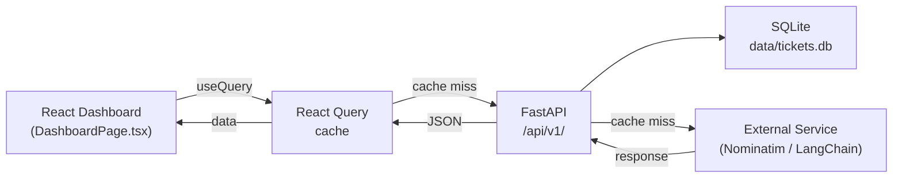

# High-Level Design — [FILL: Feature/Release Name]

## Document Metadata

| Field | Value |
|---|---|
| Release | [FILL: e.g., Release 15 — Feature Name] |
| RICEF ID | [FILL: R-xx] |
| RICEF Type | [FILL: R / I / C / E / F] |
| Author | NOC Platform Team |
| Date | [FILL: YYYY-MM-DD] |
| Version | [FILL: e.g., 1.0] |
| Status | [FILL: Draft / Review / Approved] |

## Platform Reference [PRE-FILLED]

- Backend: FastAPI 0.115 · Python 3.12 · SQLite (`data/tickets.db`) · LangChain 0.3 · ChromaDB
- Frontend: React 18 · TypeScript · Vite · TailwindCSS · shadcn/ui · Recharts · React Query v5
- Repository path: `ticket-resolve/`

---

## 1. Architecture Overview

<!-- Provide an ASCII diagram or Mermaid flowchart showing components and data flow.
     Use the style below for Mermaid, or replace with ASCII art.

     Example Mermaid:

-->

[FILL]

---

## 2. Component Inventory

| Component | Layer | File Path | Responsibility |
|---|---|---|---|
| [FILL: e.g., HotNodesWidget] | Frontend | `frontend/src/components/HotNodesWidget.tsx` | [FILL: e.g., Renders top-10 node leaderboard with stacked bars] |
| [FILL: e.g., locations router] | Backend | `app/api/v1/locations.py` | [FILL: e.g., Geocodes addresses, returns location summary] |
| [FILL: e.g., location_geocache] | Database | `data/tickets.db` | [FILL: e.g., Caches Nominatim results to avoid re-geocoding] |
| [FILL: add rows] | | | |

---

## 3. API Contract Summary

| Method | Path | Request | Response | Notes |
|---|---|---|---|---|
| GET | `/api/v1/[FILL]` | — | `[FILL: ResponseModel]` | [FILL: e.g., Returns top-10 nodes sorted by ticket_count] |
| [FILL] | | | | |

---

## 4. Data Store Design

<!-- New tables or columns introduced by this release. Full DDL belongs in LLD; summarise here. -->

| Table | Change Type | Purpose |
|---|---|---|
| [FILL: e.g., location_geocache] | New table | [FILL: e.g., Persist geocoded lat/lng keyed by address string] |
| [FILL: e.g., telco_tickets] | New column: `location_id` | [FILL: e.g., Expose pre-existing DB column in API response] |
| [FILL: add rows] | | |

---

## 5. External Integrations

| Service | Protocol | Auth | Rate Limit | Fallback |
|---|---|---|---|---|
| [FILL: e.g., Nominatim OSM] | HTTPS GET | None (User-Agent header required) | 1 req/s | [FILL: e.g., Cache `failed=1`, skip in response] |
| [FILL: add rows] | | | | |

---

## 6. Security Considerations

- **SQL injection:** All queries use `aiosqlite` parameterised statements (`?` placeholders) — no string interpolation
- **Input validation:** FastAPI + Pydantic v2 validates all request bodies and query params before handler execution
- **CORS:** Configured globally in `app/main.py` — restricted to `http://localhost:5173` in dev
- **External data:** Nominatim/external responses are stored as-is — no executable content risk (text only)
- [FILL: any additional considerations for this release]

---

## 7. Technology Decisions

| Decision | Choice | Rationale |
|---|---|---|
| [FILL: e.g., Map library] | react-leaflet + OpenStreetMap | [FILL: e.g., No API key required; OSM tiles are free for internal dashboards] |
| [FILL: e.g., Geocoding] | Nominatim (OSM) | [FILL: e.g., Free, no account needed; 1 req/s limit is acceptable for one-time batch] |
| [FILL: e.g., Cache backend] | SQLite table | [FILL: e.g., Already present in project; avoids adding Redis dependency] |
| [FILL: add rows] | | |
